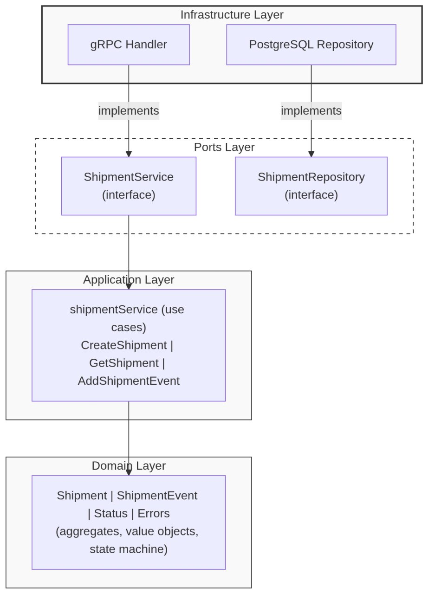

# Technical Task of Vektor TMS
# Shipment gRPC Microservice

A gRPC microservice for tracking shipments and their status changes during transportation. Built with Go using Clean Architecture principles.

---

## Requirements

- Go 1.26+
- Docker and Docker Compose

---

## Running the Service

### With Docker Compose

```bash
docker compose up --build
```

This starts the application and a PostgreSQL 17 database. The gRPC server listens on port `50051`. Database migrations run automatically on startup.

### Locally

Start only the database:

```bash
docker compose up db -d
```

Copy the example environment file and fill in the values:

```bash
cp .env.example .env
```

Run the service:

```bash
make run
```

---

## Running the Tests

### Unit tests

No external dependencies required — no database or gRPC connection needed.

```bash
make test
```

Or directly:

```bash
go test ./internal/... -v
```

### Integration tests

Integration tests run against a real PostgreSQL database. Start the database first:

```bash
docker compose up db -d
```

Then run:

```bash
make test-integration
```

Integration tests use the same `DB_*` environment variables as the service. They are compiled and run only when the `integration` build tag is passed, so `make test` never requires a database.

---

## Architecture

The project follows Clean Architecture. Each layer depends only on the layer below it, and all cross-layer communication happens through interfaces.



Port interfaces (`internal/ports/repository.go`) define the contract between the application and infrastructure layers. The domain package has no external dependencies.

---

## Project Structure

```
.
├── cmd
│   └── main.go                          — entry point, manual dependency wiring
├── config
│   └── config.go                        — environment variable loading
├── doc
│   └── image.png
├── docker-compose.yml
├── Dockerfile
├── gen
│   └── shipment
│       ├── shipment_grpc.pb.go          — generated gRPC code
│       └── shipment.pb.go               — generated protobuf code
├── go.mod
├── go.sum
├── internal
│   ├── application
│   │   ├── service.go                   — use cases
│   │   └── service_test.go
│   ├── domain                           — business entities and rules
│   │   ├── errors.go
│   │   ├── event.go
│   │   ├── shipment.go
│   │   ├── shipment_test.go
│   │   ├── status.go
│   │   └── status_test.go
│   ├── infrastructure
│   │   ├── grpc
│   │   │   ├── handler.go               — gRPC handler (proto <-> domain)
│   │   │   └── server.go               — gRPC server lifecycle
│   │   └── persistence
│   │       └── postgres
│   │           ├── repository.go        — PostgreSQL implementation
│   │           └── repository_integration_test.go
│   └── ports
│       └── repository.go               — repository interfaces
├── Makefile
├── migrations
│   └── 001_init.sql                     — database schema
├── proto
│   └── shipment.proto                   — service contract
└── README.md

16 directories, 26 files
```

---

## Shipment Status Lifecycle

Every shipment starts as `PENDING`. Status changes follow a strict state machine:

```
PENDING --> PICKED_UP --> IN_TRANSIT --> DELIVERED
   |            |              |
   v            v              v
CANCELLED   CANCELLED      CANCELLED
```

Rules enforced at the domain level:

- `DELIVERED` and `CANCELLED` are terminal — no further transitions are allowed
- Cancellation is permitted from any non-terminal state
- Invalid transitions (e.g. `PENDING -> DELIVERED`) are rejected with an error
- Duplicate transitions (e.g. `PICKED_UP -> PICKED_UP`) are rejected
- Every status change creates an immutable `ShipmentEvent` record

---

## Design Decisions

**Clean Architecture over a simpler layered approach** — the domain and application logic are fully independent from gRPC and PostgreSQL. Swapping the database or transport layer requires implementing one interface, not touching business logic.

**Manual dependency injection** — dependencies are wired explicitly in `cmd/main.go` with no framework. The chain is straightforward to follow:

```
config -> pgxpool -> postgres repos -> application service -> gRPC handler -> gRPC server
```

**Raw SQL with pgx/v5** — no ORM. SQL queries are explicit, easy to read, and predictable in behavior.

**Domain errors mapped at the transport boundary** — the gRPC handler is the only place that knows about gRPC status codes:

| Domain error | gRPC code |
|---|---|
| `ErrShipmentNotFound` | `NOT_FOUND` |
| `ErrInvalidStatusTransition` | `INVALID_ARGUMENT` |
| `ErrShipmentTerminated` | `FAILED_PRECONDITION` |
| `ErrDuplicateReferenceNumber` | `ALREADY_EXISTS` |
| `ErrMissingRequiredField` | `INVALID_ARGUMENT` |
| `ErrInvalidFieldValue` | `INVALID_ARGUMENT` |

**No mocking library** — test mocks are plain structs that implement the port interfaces. Go interfaces make this straightforward without additional dependencies.

---

## Assumptions

- **Single-node deployment.** No distributed locking is implemented. Consistency relies on PostgreSQL constraints (e.g. the unique index on `reference_number`).
- **No authentication.** Auth would be handled by a gRPC interceptor or API gateway in production.
- **Migrations run at startup.** A dedicated migration tool would be more appropriate in production.
- **Monetary values use float64.** A production system should use a fixed-point decimal type to avoid floating-point precision issues.
- **All timestamps are UTC** and stored as `TIMESTAMPTZ`.
- **Driver revenue of zero is valid.** It may represent a flat-rate or internally handled arrangement. Negative revenue is rejected.


Note: The documentation is in English because the assignment was written in English.